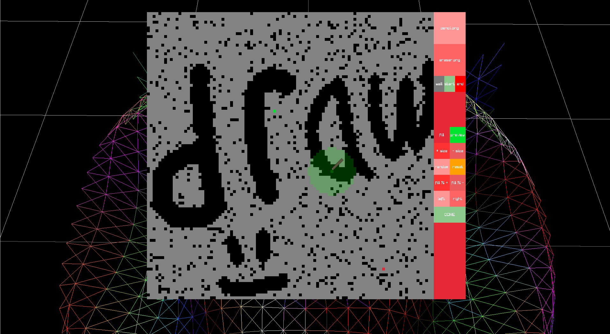
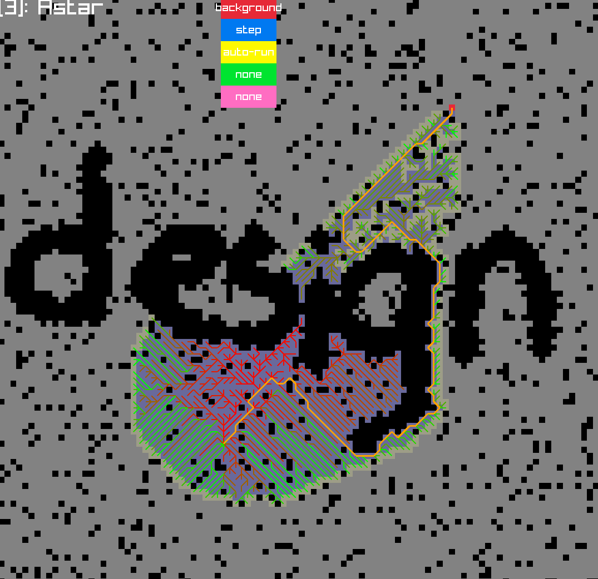
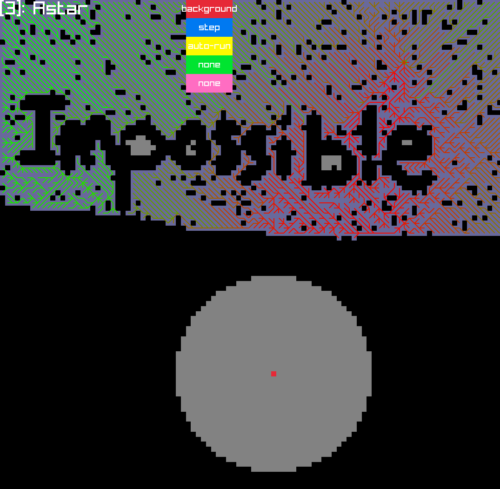
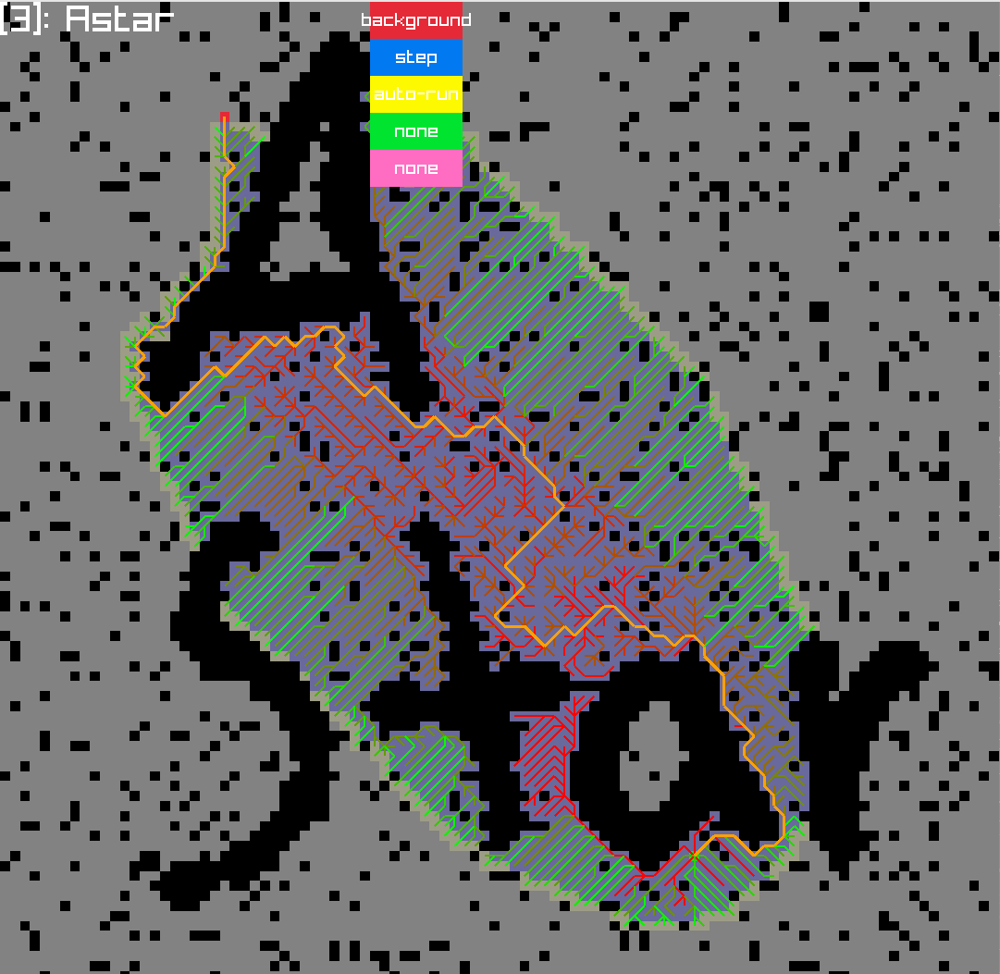
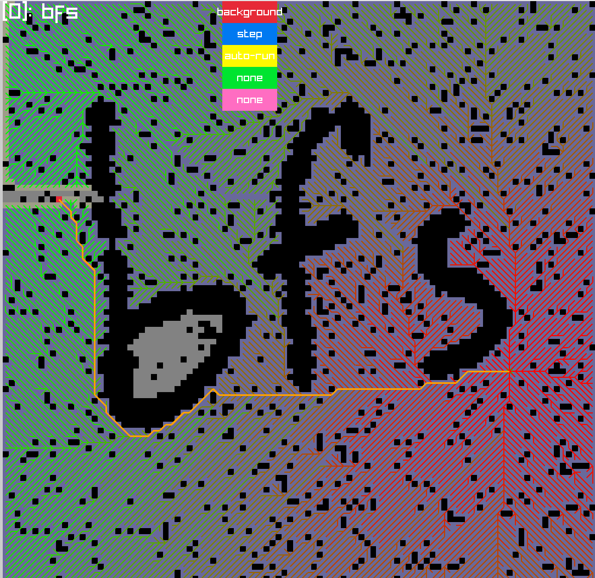
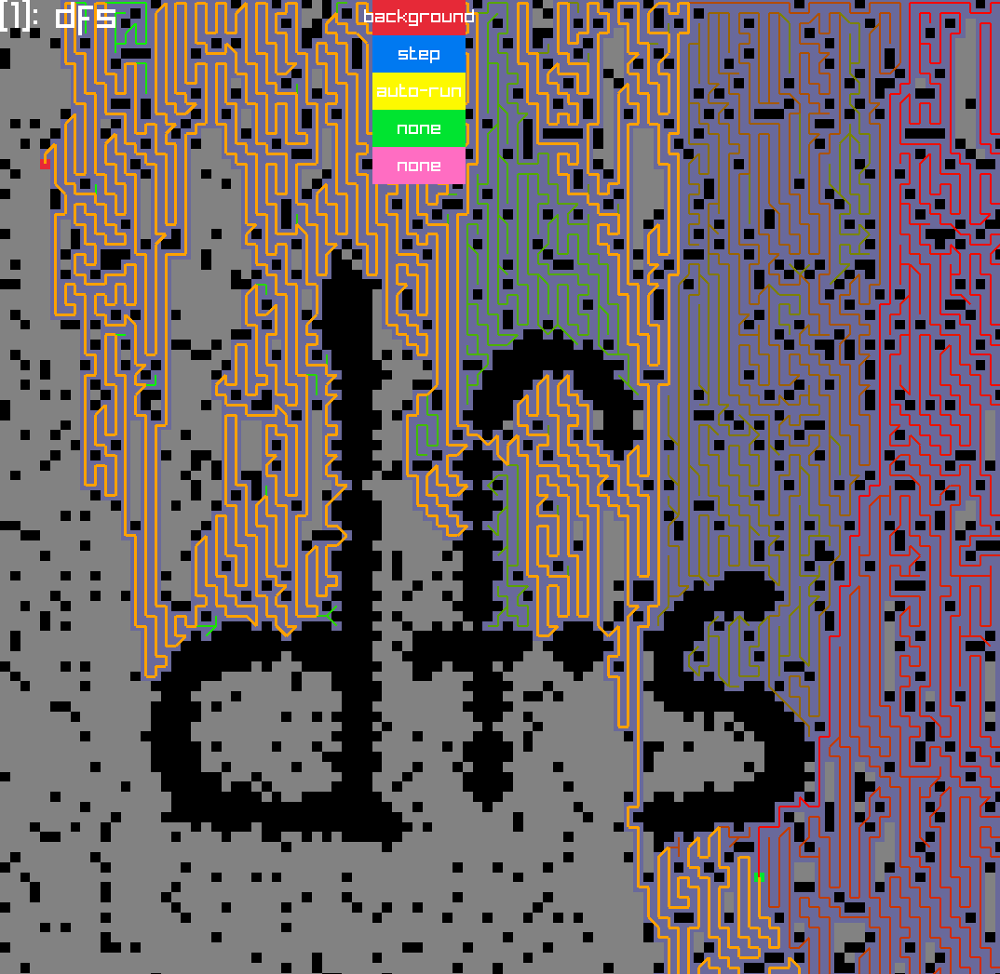

# 2d-path-finding
This is my project for CSCI 411 @ CSU Chico where I developed a program to show step by step comparisons of different path finding algorithms actively running with a customizeable environment.

## Demo
Here is a demo video of the program being used:

## Drawing

You are able to draw and design in the tile grid whatever environment you would like either from a blank canvas, or from a randomely generated one using the *space* key. Given the ability to use this customized layout you can run a simulation on the path finding algorithm/s of choice and see a *real time* comparison.

---

## Impossible

Maybe you want to give your custom path finding algorithm that you implement or one of the default algorithms a challenge. Maybe you want it to be impossible just to see what it does. Either way, you can!

## Featured path finding algorithms
Some of the current built in algorithms are:
- Astar
- bfs
- dfs
- dfs updated *( while backtracking it checks if it finds a shorter path and updates this path )*

